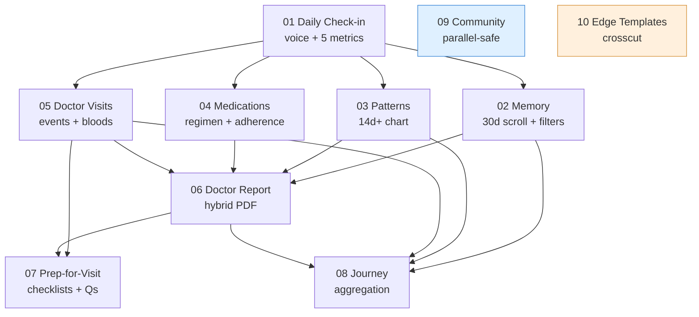
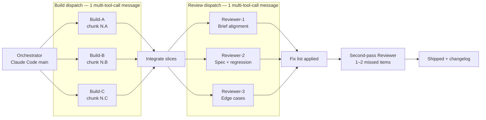
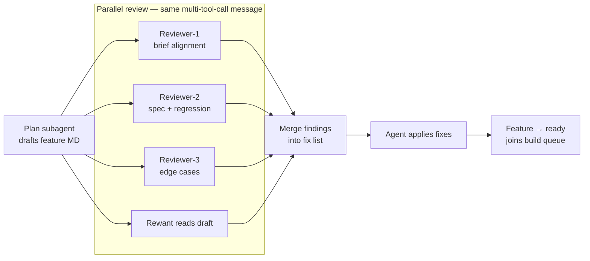
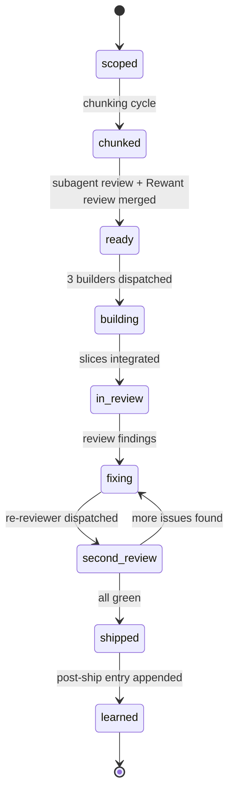
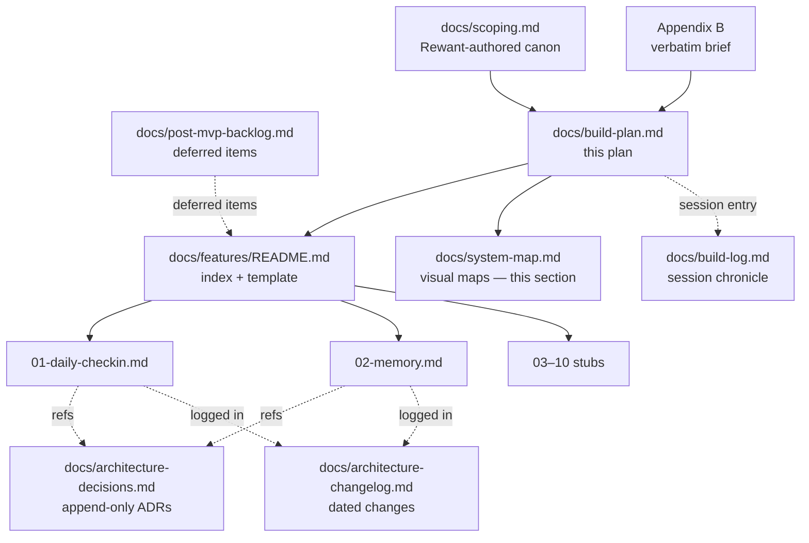
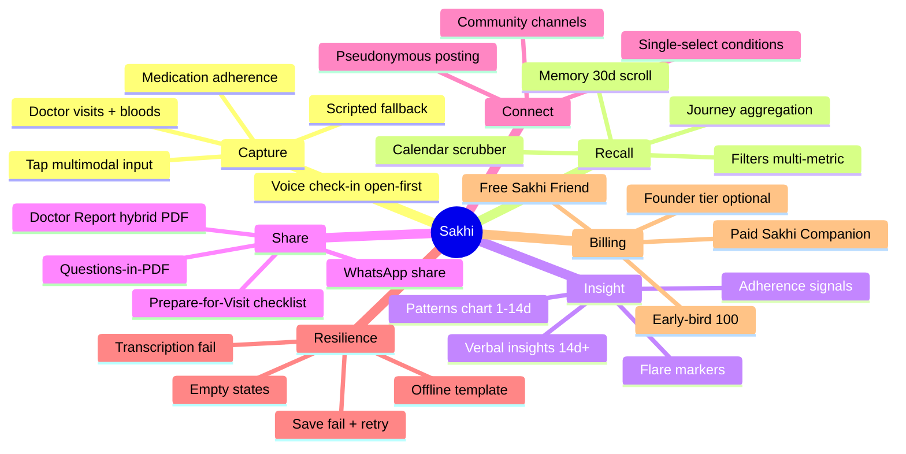
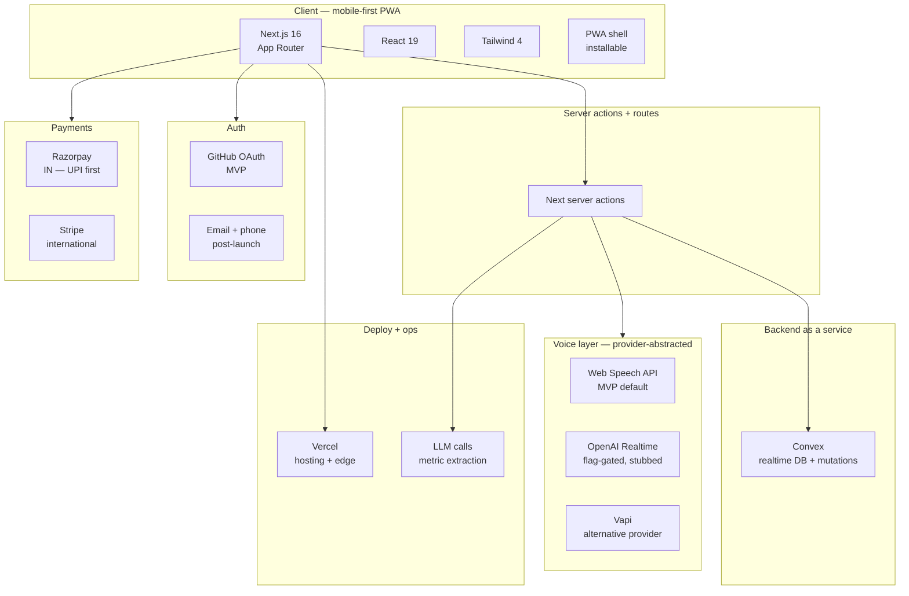

# Sakhi — Wholesome Build Plan

> **Status:** Plan ready for review.
> **Date:** 2026-04-25
> **Project:** Autoimmune Health Companion (Sakhi)
> **Location:** `/Volumes/Coding Projects + Docker/autoimmune-health-companion/`

---

## Section 1 — Context

Sakhi is a 10-feature MVP. `docs/scoping.md` is canonical but narrative — it does not yet contain deliverable chunks, user stories, or acceptance criteria. Building it feature-by-feature without structure risks: (a) losing sight of cross-feature dependencies (Memory reads Check-in data; Patterns needs ≥14d of data), (b) drifting from four-doc discipline, (c) not exploiting the 3-build + 3-review parallel pattern defined in the Project Process Playbook.

**Intended outcome:** a hierarchy — scoping doc → feature MD → chunks → user stories → 4-lane acceptance — that lets Rewant dispatch parallel build work across multiple tabs on deliberately disjoint file slices, with a status vocabulary and review cadence that makes every cycle auditable.

**Depth:** Structure + Feature 01 (Daily Check-in) and Feature 02 (Memory) fully broken down. Features 03–10 get 1-line intent + chunk estimate; their first build task is a "chunking cycle" that fills in stories + acceptance.

---

## Section 2 — Structure & Conventions

### 2.1 Docs scaffolding

New folder: `docs/features/`
- `docs/features/README.md` — index (table of 10 features + links + status) and the Feature MD template
- `docs/features/NN-slug.md` — one file per feature (10 total)

The four-doc discipline stays intact. Feature MDs are a *fifth* layer under scoping — they never supersede ADRs or the backlog, they reference them.

### 2.2 Feature MD template

```markdown
---
number: NN
name: Feature Name
slug: feature-slug
status: scoped
depends_on: [01-daily-checkin]
blocks: [06-journey, 07-patterns]
owner: rewant
scoping_ref: docs/scoping.md#feature-N-...
adr_refs: [ADR-005, ADR-014]
last_updated: 2026-04-25
---

# Feature NN — Feature Name

## Intent
One paragraph. What this feature does for Sonakshi. Why it exists.

## Scope in / out
- In: ...
- Out (deferred, linked to backlog): ...

## Dependencies
What data/features this reads. What depends on this shipping.

## Chunks
Link to each chunk section below. Chunks are disjoint file-ownership slices.

### Chunk N.A — <name>
- **Owner:** build-agent-A (Cycle X)
- **Files owned:** (exact paths, disjoint from other chunks in the same cycle)
- **Status:** scoped | ready | building | in-review | fixing | second-review | shipped
- **Stories:** US-N.A.1, US-N.A.2, ...

## User Stories

### US-N.A.1 — <title>
**As** Sonakshi **I want** ... **so that** ...

**Functional requirement:** ...

**Acceptance criteria:**
- **UX:** (flow, state transitions, what the user feels)
- **UI:** (components, visual states, breakpoints, accessibility)
- **Backend / data:** (schema, mutations, queries, invariants, error modes)
- **UX copy:** (exact strings; language guardrail: "support-system", never "caregiver/squad")

## Review notes
(Filled in after build cycles. Links to review-subagent findings.)

## Learnings
(Filled in post-ship — what surprised us, what we'd change.)
```

### 2.3 Status vocabulary

Every feature and every chunk carries one of:

| Status | Meaning |
|---|---|
| `scoped` | Exists in scoping doc only. No chunks defined. |
| `chunked` | Chunks + stories + acceptance written in the feature MD. |
| `ready` | Chunk has disjoint file ownership assigned and is queued for a build cycle. |
| `building` | Active build subagent is working on this chunk. |
| `in-review` | Build returned; 3 review subagents dispatched. |
| `fixing` | Review findings being addressed. |
| `second-review` | Fixes returned; one re-review agent checks the 1–2 things pass one missed. |
| `shipped` | Merged, acceptance criteria met, integration passes. |
| `learned` | Post-ship entry appended to feature MD + `architecture-changelog.md`. |

### 2.4 Build cycle pattern

Each cycle is one round of 3-build + 3-review + optional second-pass, driven by a single multi-tool-call message per fan-out.

1. **Dispatch build (1 message, 3 Agent calls):** Three build subagents, each given one chunk. File ownership disjoint. Each agent has: the chunk's user stories, acceptance criteria, files it owns, and a "do not touch" list of files owned by siblings.
2. **Integrate:** merge returned slices. Resolve any accidental overlap.
3. **Dispatch review (1 message, 3 Agent calls):** Three review subagents, roles below. Each reviews the *entire* cycle's delta, not one slice.
4. **Triage findings:** build a fix list grouped by chunk.
5. **Fix.** Status → `fixing`.
6. **Second review pass:** one Agent call. Prompt includes "decisions already made: X, Y, Z — don't re-litigate." Hunts for the 1–2 things the first pass missed.
7. **Ship.** Status → `shipped`. Append changelog entry.

### 2.5 Review subagent roles

Three parallel reviewers, disjoint concerns:

- **Reviewer-1 (Brief alignment):** Does the delta match the user stories + 4-lane acceptance verbatim? Flags scope creep, missing criteria, copy drift (especially "support-system" vs "caregiver").
- **Reviewer-2 (Spec violation + regression):** Does the delta violate ADRs? Does it break prior features' tests / flows? Checks schema changes against existing queries, checks routing, checks auth.
- **Reviewer-3 (Edge cases):** Offline, transcription fail, empty data, paywall boundary, concurrent edits, date-boundary (midnight-IST), first-ever check-in, 30th check-in, locale/length. Tests the chunk against Feature 10 (Edge-case Templates) expectations.

Each reviewer returns: findings list, severity, suggested fix, file:line pointer.

### 2.6 Chunking convention

**One chunk = one build-subagent's slice in a single cycle.** Rules:
- Files owned by a chunk are disjoint from sibling chunks in the same cycle.
- A chunk can touch files from a *prior, shipped* cycle if it needs to extend them — but it takes exclusive ownership for the current cycle.
- A cycle has at most 3 chunks (the three parallel agents).
- A feature's chunks are numbered `N.A`, `N.B`, `N.C` (cycle 1) and `N.D`, `N.E`, `N.F` (cycle 2). Large features can grow a cycle 3.
- Each chunk holds 2–3 user stories. If a chunk is growing past 3 stories, split it into a new cycle.

---

## Section 3 — Feature Inventory & Sequence

Build order is dependency-driven. Features marked `parallel-safe` in the "Can run with" column can be dispatched alongside the current primary feature without file conflict.

| # | Name | File | Status | Depends on | Blocks | Can run with | Intent (1-line) |
|---|---|---|---|---|---|---|---|
| 01 | Daily Voice Check-in | `docs/features/01-daily-checkin.md` | chunked | — | 02, 06, 07 | 10 | Hybrid open-first voice + scripted fallback; 5 required metrics. |
| 02 | Memory | `docs/features/02-memory.md` | chunked | 01 | 06 | 10, 09 | 30-day scroll + filters + calendar scrubber + edit/delete. |
| 03 | Patterns | `docs/features/03-patterns.md` | scoped | 01 (≥14d data) | 05, 06 | 04, 09, 10 | Multi-metric line chart; visual 1–14, verbal 14+. |
| 04 | Medications | `docs/features/04-medications.md` | scoped | 01 | 05 | 03, 09, 10 | Regimen tracker: dosage + frequency + adherence. |
| 05 | Doctor Visits & Blood Work | `docs/features/05-doctor-visits.md` | scoped | 01 | 06, 08 | 09, 10 | First-class events; manual + voice-extracted; timeline markers. |
| 06 | Doctor Report (Hybrid PDF) | `docs/features/06-doctor-report.md` | scoped | 01, 02, 03, 04, 05 | 08 | 09 | Summary + appendix PDF; patient + doctor views; WhatsApp share. |
| 07 | Prepare-for-Visit | `docs/features/07-prepare-for-visit.md` | scoped | 05, 06 | — | 09 | Tripartite: checklists + annotations + Questions in PDF. |
| 08 | Journey | `docs/features/08-journey.md` | scoped | 02, 03, 05, 06 | — | 09 | Unified "looking back" pillar aggregating Memory + Reports + Patterns + timelines. |
| 09 | Community | `docs/features/09-community.md` | scoped | — | — | 01–08, 10 | Slack-style peer channels; text-only, pseudonymous, single-select conditions. |
| 10 | Edge-case Templates | `docs/features/10-edge-case-templates.md` | scoped | — | — | 01–09 | Full-screen handlers: conn error, transcription fail, save fail, offline, empty Journey. Scaffold alongside every feature; finalize last. |

---

## Section 4 — Feature 01: Daily Voice Check-in (FULL BREAKDOWN)

**Intent:** Sonakshi opens the app, taps the orb, speaks freely for ~30–60s about her day. The system transcribes, extracts the 5 required metrics (pain 1–10, mood, medication adherence, flare flag, energy 1–10). If all 5 are covered, confirm and save (ADR-005: skip Stage 2). If some are missing, enter Stage 2 scripted fallback with tap inputs available for each metric.

**Files owned across this feature** (authoritative list; no chunk adds files outside this):
```
app/(check-in)/page.tsx
app/(check-in)/layout.tsx
components/check-in/Orb.tsx
components/check-in/OrbStates.tsx
components/check-in/ScreenShell.tsx
components/check-in/ConfirmSummary.tsx
components/check-in/ScriptedPrompt.tsx
components/check-in/TapInput.tsx
lib/voice/provider.ts
lib/voice/web-speech-adapter.ts
lib/voice/openai-realtime-adapter.ts
lib/voice/types.ts
lib/checkin/state-machine.ts
lib/checkin/extract-metrics.ts
lib/checkin/coverage.ts
convex/schema.ts                  // append only — checkIns table
convex/checkIns.ts                // create, list, get
tests/check-in/*.test.ts
```

### Cycle 1 — Foundation (3 chunks, parallel)

#### Chunk 1.A — Voice capture + provider abstraction + Web Speech fallback
- **Owner:** build-agent-A
- **Files owned:**
  - `lib/voice/provider.ts`
  - `lib/voice/types.ts`
  - `lib/voice/web-speech-adapter.ts`
  - `lib/voice/openai-realtime-adapter.ts` (stub — interface only, implementation behind a flag)
  - `tests/check-in/voice-provider.test.ts`
- **Stories:** US-1.A.1, US-1.A.2, US-1.A.3

**US-1.A.1 — Provider interface**
- *As* a developer *I want* a single `VoiceProvider` interface *so that* Web Speech and OpenAI Realtime can be swapped without touching the UI.
- **Functional requirement:** `interface VoiceProvider { start(): Promise<void>; stop(): Promise<Transcript>; onPartial(cb): void; onError(cb): void; capabilities: { partials: boolean; vad: boolean } }`. A factory `getVoiceProvider()` returns the active provider based on env / feature flag, defaulting to Web Speech.
- **Acceptance:**
  - **UX:** no user-visible change; provider selection invisible.
  - **UI:** none.
  - **Backend / data:** provider returns `{ text, durationMs, confidence? }`. Errors typed: `permission-denied`, `no-speech`, `network`, `unsupported`, `aborted`.
  - **UX copy:** none.

**US-1.A.2 — Web Speech fallback adapter**
- *As* Sonakshi *I want* voice capture to work in browsers that block OpenAI Realtime *so that* I can still check in.
- **Functional requirement:** Web Speech API adapter implements `VoiceProvider`. Handles `SpeechRecognition` events; emits partials via `onPartial`; resolves `stop()` with final transcript. Locale defaults to `en-IN`.
- **Acceptance:**
  - **UX:** mic permission prompt appears on first use; denial routes to error template (Feature 10 hook).
  - **UI:** none in this chunk (orb lives in 1.C).
  - **Backend / data:** no data persisted here; transcript returned in-memory.
  - **UX copy:** error thrown carries key `voice.permission_denied` — resolved to user string in 1.C.

**US-1.A.3 — Realtime adapter stub**
- *As* the team *I want* the OpenAI Realtime adapter scaffolded behind a flag *so that* we can implement it in a later sprint without refactoring.
- **Functional requirement:** `openai-realtime-adapter.ts` implements the interface but throws `NotImplementedError` on `start()`. Feature flag `VOICE_PROVIDER=web-speech|openai-realtime` gates selection.
- **Acceptance:**
  - **UX:** n/a.
  - **UI:** n/a.
  - **Backend / data:** flag read from env. Default `web-speech`.
  - **UX copy:** none.

**Do-not-touch (this chunk):** anything in `convex/`, `components/`, `app/`.

---

#### Chunk 1.B — Check-in data model + Convex mutations
- **Owner:** build-agent-B
- **Files owned:**
  - `convex/schema.ts` (append `checkIns` table only)
  - `convex/checkIns.ts` (new file)
  - `tests/check-in/convex-checkins.test.ts`
- **Stories:** US-1.B.1, US-1.B.2, US-1.B.3

**US-1.B.1 — `checkIns` table**
- *As* the system *I want* a durable check-in record *so that* Memory, Patterns, and Doctor Report can read it.
- **Functional requirement:** Convex table `checkIns` with fields: `userId`, `date` (YYYY-MM-DD in IST), `createdAt`, `pain` (1–10), `mood` (enum), `adherenceTaken` (bool), `flare` (bool), `energy` (1–10), `transcript` (string), `stage` ("open" | "scripted" | "hybrid"), `durationMs`, `providerUsed`.
- **Acceptance:**
  - **UX:** n/a.
  - **UI:** n/a.
  - **Backend / data:** index on `(userId, date)` unique-ish (one check-in per user per IST day; conflict handled in 1.F). Validators enforce ranges. Schema migration documented in `architecture-changelog.md`.
  - **UX copy:** none.

**US-1.B.2 — `createCheckin` mutation**
- *As* the UI *I want* to persist a completed check-in *so that* it shows up in Memory.
- **Functional requirement:** mutation accepts validated payload, writes row, returns `{ id, date }`. Throws `DuplicateCheckinError` if one already exists for `(userId, date)`.
- **Acceptance:**
  - **UX:** n/a (UI consumes in 1.F).
  - **UI:** n/a.
  - **Backend / data:** idempotent on client retry if same `clientRequestId` passed. Auth required.
  - **UX copy:** error codes: `checkin.duplicate`, `checkin.invalid_range`.

**US-1.B.3 — `listCheckins` + `getCheckin` queries**
- *As* Memory *I want* to read recent check-ins *so that* it can render the 30-day scroll.
- **Functional requirement:** `listCheckins({ limit, cursor, fromDate?, toDate? })` returns paged results sorted by `date desc`. `getCheckin(id)` returns one.
- **Acceptance:**
  - **UX:** n/a.
  - **UI:** n/a.
  - **Backend / data:** paywall boundary not enforced here (UI layer concern); query always returns authoritative data. Tests cover empty, 1 row, 100 rows, date-filter.
  - **UX copy:** none.

**Do-not-touch:** `components/`, `app/`, `lib/`.

---

#### Chunk 1.C — Orb UI + screen shell + state machine
- **Owner:** build-agent-C
- **Files owned:**
  - `app/(check-in)/page.tsx`
  - `app/(check-in)/layout.tsx`
  - `components/check-in/Orb.tsx`
  - `components/check-in/OrbStates.tsx`
  - `components/check-in/ScreenShell.tsx`
  - `lib/checkin/state-machine.ts`
  - `tests/check-in/state-machine.test.ts`
- **Stories:** US-1.C.1, US-1.C.2, US-1.C.3

**US-1.C.1 — State machine**
- *As* the check-in screen *I want* a single state machine *so that* UI and side effects stay in sync.
- **Functional requirement:** States: `idle → requesting-permission → listening → processing → confirming → saving → saved | error`. Transitions triggered by orb tap, provider events, mutation result. Implemented as pure reducer + hook `useCheckinMachine()`.
- **Acceptance:**
  - **UX:** tap on idle orb → listening within 300ms. Tap during listening → stop + processing. Any error state routes to error template (Feature 10 hook, stubbed).
  - **UI:** state drives orb visual (1.C.2) and screen content.
  - **Backend / data:** consumes `VoiceProvider` (1.A) via prop injection.
  - **UX copy:** state labels for a11y: "Tap to start", "Listening", "Processing", "Review and save".

**US-1.C.2 — Orb visual**
- *As* Sonakshi *I want* a calming orb that breathes when listening *so that* I feel heard.
- **Functional requirement:** Orb is the primary tap target. 4 visual states: idle (soft pulse), listening (waveform-reactive bloom), processing (indeterminate swirl), error (dimmed red pulse). 44pt min tap target. Respects `prefers-reduced-motion`.
- **Acceptance:**
  - **UX:** one-tap start, one-tap stop. Haptic feedback if supported.
  - **UI:** Tailwind + CSS keyframes; no JS animation libs. Mobile-first; full-bleed on small screens. Orb contrast passes WCAG AA against background.
  - **Backend / data:** none.
  - **UX copy:** `aria-label="Start daily check-in"` / `"Stop check-in"` toggling by state.

**US-1.C.3 — Screen shell + routing**
- *As* Sonakshi *I want* `/check-in` to be the primary action on the home screen *so that* the daily habit is frictionless.
- **Functional requirement:** `app/(check-in)/page.tsx` renders `<ScreenShell>` with orb + transient copy + error template slot. `layout.tsx` handles auth gate.
- **Acceptance:**
  - **UX:** unauthed → redirect to sign-in. Authed → orb in idle.
  - **UI:** safe-area padding; no scroll; full viewport height.
  - **Backend / data:** auth check via Convex `useQuery(currentUser)`.
  - **UX copy:** empty-first-time heading: "How's today feeling?" — subcopy: "Tap the orb and tell me in your own words."

**Do-not-touch:** `convex/`, `lib/voice/`.

---

### Cycle 2 — Conversation + save (3 chunks, parallel, after Cycle 1 ships)

#### Chunk 1.D — Open-first engine + LLM metric extraction
- **Owner:** build-agent-A
- **Files owned:**
  - `lib/checkin/extract-metrics.ts`
  - `lib/checkin/coverage.ts`
  - `tests/check-in/extract-metrics.test.ts`
- **Stories:** US-1.D.1, US-1.D.2

**US-1.D.1 — Metric extraction from free-form transcript**
- *As* Sonakshi *I want* the app to understand what I said in my own words *so that* I don't have to answer a questionnaire when I already explained.
- **Functional requirement:** `extractMetrics(transcript): Partial<CheckinMetrics>` calls LLM with a strict JSON schema for the 5 metrics. Returns partial if some aren't inferable. No hallucination: if unsure, omit rather than guess.
- **Acceptance:**
  - **UX:** extraction completes within 3s (p50) from transcript end.
  - **UI:** n/a.
  - **Backend / data:** LLM call routed through a server action. Prompt tested with ≥20 fixtures covering: all-5-covered, 3-of-5, 0-of-5, ambiguous pain, mood-only, medication-negation ("forgot"), flare language ("it's really bad today").
  - **UX copy:** none (prompt is internal).

**US-1.D.2 — Coverage check (ADR-005)**
- *As* the flow *I want* to know whether Stage 2 is needed *so that* we skip scripted prompts when open-first already covered everything.
- **Functional requirement:** `coverage(metrics): { covered: Metric[], missing: Metric[] }`. If `missing.length === 0`, state machine transitions `processing → confirming` directly. Otherwise `processing → scripted`.
- **Acceptance:**
  - **UX:** invisible decision point; user does not see Stage 2 if not needed.
  - **UI:** n/a.
  - **Backend / data:** pure function; unit-tested.
  - **UX copy:** none.

**Do-not-touch:** `components/`, `app/`, `convex/`.

---

#### Chunk 1.E — Stage 2 scripted fallback + tap multimodal inputs
- **Owner:** build-agent-B
- **Files owned:**
  - `components/check-in/ScriptedPrompt.tsx`
  - `components/check-in/TapInput.tsx`
  - `tests/check-in/scripted-prompt.test.tsx`
- **Stories:** US-1.E.1, US-1.E.2

**US-1.E.1 — Scripted prompt flow for missing metrics**
- *As* Sonakshi *I want* gentle follow-up questions only for the things I didn't mention *so that* it doesn't feel like a form.
- **Functional requirement:** `<ScriptedPrompt metric={...} />` renders one prompt at a time for each missing metric in fixed order (pain → mood → adherence → flare → energy). Voice answer or tap answer both accepted. Progresses to next missing metric on answer.
- **Acceptance:**
  - **UX:** each prompt full-screen, one question visible; skip allowed (marks metric as "not answered" — state machine decides if required). Back arrow returns to previous prompt.
  - **UI:** large question text; answer area below; orb remains visible for voice; tap input inline.
  - **Backend / data:** state held in reducer, not persisted until save.
  - **UX copy:** pain: "How's pain today, on 1 to 10?" · mood: "And how are you feeling in yourself?" · adherence: "Did you take your meds today?" · flare: "Is this a flare day?" · energy: "Energy — 1 low, 10 full tank?"

**US-1.E.2 — Tap input per metric type**
- *As* Sonakshi *I want* to tap when my voice isn't working or I don't want to speak *so that* I can still finish.
- **Functional requirement:** `<TapInput metric={...} />` renders appropriate control: 1–10 slider (pain, energy), chip group (mood), yes/no toggle (adherence, flare). Updates reducer on change.
- **Acceptance:**
  - **UX:** controls usable one-handed on small phones. Values visible and adjustable before submit.
  - **UI:** 44pt min hit targets; slider shows numeric value above thumb; chips min 2-per-row.
  - **Backend / data:** values typed to metric's schema.
  - **UX copy:** mood chips: "heavy", "flat", "okay", "bright", "great" (match scoping). Adherence: "took them" / "missed". Flare: "yes, flaring" / "not a flare".

**Do-not-touch:** `lib/checkin/`, `convex/`, `app/`, `Orb*`.

---

#### Chunk 1.F — Confirmation summary + save + error/retry
- **Owner:** build-agent-C
- **Files owned:**
  - `components/check-in/ConfirmSummary.tsx`
  - `tests/check-in/confirm-save.test.tsx`
- **Stories:** US-1.F.1, US-1.F.2

**US-1.F.1 — Confirmation summary card**
- *As* Sonakshi *I want* to see what the app understood *so that* I can fix anything wrong before saving.
- **Functional requirement:** `<ConfirmSummary metrics={...} onEdit={...} onSave={...} />` displays all 5 metrics as editable rows. Tap a row → inline TapInput (1.E) to amend.
- **Acceptance:**
  - **UX:** review takes <10s to scan. Edit is one tap + one adjust + done. Save is a single tappable primary button at the bottom.
  - **UI:** each row: metric label + current value + edit affordance. Save button full-width, sticky bottom.
  - **Backend / data:** values still in reducer; save triggers `createCheckin` mutation.
  - **UX copy:** heading "Here's what I heard". Save button: "Save today's check-in". Edit affordance aria: "Edit {metric}".

**US-1.F.2 — Save + error + retry**
- *As* Sonakshi *I want* a clear outcome when I save *so that* I know it worked (or what to do if not).
- **Functional requirement:** On save, call `createCheckin`. Success → transition to `saved` (brief confirmation + route to home). Error (network / duplicate / validation) → render Feature 10 save-fail template with retry button that re-invokes mutation.
- **Acceptance:**
  - **UX:** saved confirmation visible ≥1.5s with haptic tick, then auto-route. Error is non-dismissible until retry or explicit "save later" (queues in-memory for this session).
  - **UI:** success: full-screen confirmation with orb in "settled" state. Error: edge-case template with clear next action.
  - **Backend / data:** retry passes same `clientRequestId` so mutation is idempotent.
  - **UX copy:** success heading: "Got it. See you tomorrow, Sakhi's here." Error: "Couldn't save just now. Try again?" Save-later button: "Keep this for later".

**Do-not-touch:** `lib/`, `Orb*`, `ScriptedPrompt`, `TapInput`, `convex/schema.ts`.

---

## Section 5 — Feature 02: Memory (FULL BREAKDOWN)

**Intent:** Sonakshi opens Memory to see her last 30 days at a glance. Scroll through a timeline of check-ins, filter by metric or flare status, jump to a date via calendar scrubber, tap any day to see the full detail, edit or delete (ADR-aligned: no full edit on past check-ins post-MVP; MVP allows edit within 24h).

**Files owned across this feature:**
```
app/(memory)/page.tsx
app/(memory)/[date]/page.tsx
components/memory/CheckinList.tsx
components/memory/CheckinListItem.tsx
components/memory/CheckinDetail.tsx
components/memory/CalendarScrubber.tsx
components/memory/FilterBar.tsx
components/memory/EmptyState.tsx
components/memory/PaywallBanner.tsx
lib/memory/filters.ts
convex/checkIns.ts            // extend — update, softDelete, filtered list
tests/memory/*.test.ts
```

### Cycle 1 — List + detail + scrubber

#### Chunk 2.A — 30-day list query + pagination
- **Owner:** build-agent-A
- **Files owned:**
  - `convex/checkIns.ts` (extend only — `listByRange`, `listPaged`)
  - `lib/memory/filters.ts`
  - `tests/memory/list-query.test.ts`
- **Stories:** US-2.A.1, US-2.A.2

**US-2.A.1 — Range-based list with paywall boundary**
- *As* Memory *I want* a query that returns at most the last 30 days for free users *so that* the paywall is enforced server-side.
- **Functional requirement:** `listByRange({ fromDate, toDate, limit, cursor, filters? })`. For free tier: `fromDate` clamped to `today - 30d`. Paid tier: no clamp. Returns `{ items, nextCursor, clampedByTier: bool }`.
- **Acceptance:**
  - **UX:** clamp not visible as an error — UI shows paywall banner when `clampedByTier` true.
  - **UI:** n/a in this chunk.
  - **Backend / data:** tier read from user record. Index `(userId, date desc)` used.
  - **UX copy:** none.

**US-2.A.2 — Filter predicate layer**
- *As* Memory *I want* pure filter predicates *so that* client and server share filter logic.
- **Functional requirement:** `lib/memory/filters.ts`: `applyFilters(rows, { painMin?, painMax?, mood?, flareOnly?, missedMedsOnly? })`. Server uses same predicates for queries that can be indexed; client uses for in-memory refinement.
- **Acceptance:**
  - **UX:** n/a.
  - **UI:** n/a.
  - **Backend / data:** pure functions; unit-tested with 10+ fixtures.
  - **UX copy:** none.

**Do-not-touch:** `components/`, `app/`.

---

#### Chunk 2.B — List item UI + detail view
- **Owner:** build-agent-B
- **Files owned:**
  - `app/(memory)/page.tsx`
  - `app/(memory)/[date]/page.tsx`
  - `components/memory/CheckinList.tsx`
  - `components/memory/CheckinListItem.tsx`
  - `components/memory/CheckinDetail.tsx`
  - `tests/memory/list-ui.test.tsx`
- **Stories:** US-2.B.1, US-2.B.2, US-2.B.3

**US-2.B.1 — Chronological list**
- *As* Sonakshi *I want* to scroll my recent check-ins by day *so that* I can remember what I felt.
- **Functional requirement:** `<CheckinList>` renders paged results from `listByRange`. Each row = `<CheckinListItem>`. Infinite scroll uses cursor.
- **Acceptance:**
  - **UX:** smooth scroll; no layout shift on load. Day-header sticky.
  - **UI:** list rows min-height 72pt; flare days carry a small marker; missed-meds days a different marker.
  - **Backend / data:** page size 20.
  - **UX copy:** day header format: "Tue, 22 Apr" (IST). Today row: "Today".

**US-2.B.2 — List item content**
- *As* Sonakshi *I want* a one-glance summary on each row *so that* I don't have to open each one.
- **Functional requirement:** row shows: date, pain number, mood chip, flare badge (if true), missed-meds badge (if true).
- **Acceptance:**
  - **UX:** tap entire row to open detail.
  - **UI:** badges colour-independent (icon + label) for colour-blind safety.
  - **Backend / data:** from list item payload.
  - **UX copy:** flare badge label: "flare". Meds badge: "missed meds".

**US-2.B.3 — Detail view**
- *As* Sonakshi *I want* to open one day *so that* I can see everything — metrics, transcript, what I said.
- **Functional requirement:** `app/(memory)/[date]/page.tsx` loads one check-in by date. Renders `<CheckinDetail>` with all 5 metrics + transcript + edit/delete buttons (wired in 2.E).
- **Acceptance:**
  - **UX:** back navigation returns to prior scroll position.
  - **UI:** full transcript readable; metrics as labeled cards.
  - **Backend / data:** `getCheckin` by `(userId, date)`.
  - **UX copy:** heading = date. Section labels: "Pain", "Mood", "Medications", "Flare", "Energy", "What you said".

**Do-not-touch:** `CalendarScrubber`, `FilterBar`, `convex/`.

---

#### Chunk 2.C — Calendar scrubber
- **Owner:** build-agent-C
- **Files owned:**
  - `components/memory/CalendarScrubber.tsx`
  - `tests/memory/scrubber.test.tsx`
- **Stories:** US-2.C.1

**US-2.C.1 — Horizontal calendar scrubber**
- *As* Sonakshi *I want* a quick way to jump to a date *so that* I don't scroll endlessly.
- **Functional requirement:** horizontal-scroll strip of last 30 days (free) / full history (paid). Each cell marks presence of check-in + flare status. Tap cell → scrolls list to that date.
- **Acceptance:**
  - **UX:** current day centered on mount. Snap-scroll. Haptic tick on cell select.
  - **UI:** cell 48pt wide × 56pt tall. Clear today-indicator.
  - **Backend / data:** reads the same list payload as `<CheckinList>` (sibling, no duplicate query — lift state to page).
  - **UX copy:** month label sticky above strip: "April 2026".

**Do-not-touch:** anything else.

---

### Cycle 2 — Filters, edit/delete, paywall polish

#### Chunk 2.D — Filter bar (metric / flare / missed meds)
- **Owner:** build-agent-A
- **Files owned:**
  - `components/memory/FilterBar.tsx`
  - `tests/memory/filter-bar.test.tsx`
- **Stories:** US-2.D.1, US-2.D.2

**US-2.D.1 — Filter controls**
- *As* Sonakshi *I want* to narrow Memory to "only flare days" or "only missed-meds days" *so that* I can spot patterns.
- **Functional requirement:** chips: "All", "Flare days", "Missed meds", "High pain (≥7)". Multi-select; applied via `applyFilters` (2.A).
- **Acceptance:**
  - **UX:** filter state reflected in URL `?filters=flare,missedMeds` so refresh preserves.
  - **UI:** chip row horizontally scrollable; selected chip visually distinct.
  - **Backend / data:** filters passed to `listByRange`.
  - **UX copy:** chip labels verbatim above.

**US-2.D.2 — Empty filtered state**
- *As* Sonakshi *I want* a clear message when filters match nothing *so that* I'm not confused by a blank list.
- **Functional requirement:** when filtered list empty but underlying data exists, render a filter-specific empty card.
- **Acceptance:**
  - **UX:** card offers "Clear filters" button.
  - **UI:** distinct from global empty state (2.F).
  - **Backend / data:** driven by filter metadata, not query errors.
  - **UX copy:** "No days match these filters. {Clear filters}."

**Do-not-touch:** list, detail, scrubber.

---

#### Chunk 2.E — Edit / delete + confirmations
- **Owner:** build-agent-B
- **Files owned:**
  - `convex/checkIns.ts` (extend — `updateCheckin`, `softDeleteCheckin`)
  - `components/memory/CheckinDetail.tsx` (extend — wire edit/delete buttons)
  - `tests/memory/edit-delete.test.tsx`
- **Stories:** US-2.E.1, US-2.E.2

**US-2.E.1 — Edit within 48h**
- *As* Sonakshi *I want* to fix yesterday's check-in *so that* a mistyped pain value doesn't poison Patterns.
- **Functional requirement:** `updateCheckin(id, patch)` mutation. Server enforces edit window: only if `now - createdAt < 48h`. Past that, mutation throws `EditWindowExpired`. Post-MVP full-edit is in backlog.
- **Acceptance:**
  - **UX:** edit button visible only within window. After window, button replaced by "Edits locked after 48h" help text.
  - **UI:** edit triggers same TapInput components from Feature 01 (reuse, do not duplicate).
  - **Backend / data:** audit trail: `editedAt` timestamp written; original values not retained in MVP (ADR hook noted in review).
  - **UX copy:** lock copy: "Locked — you can edit check-ins within 48 hours."

**US-2.E.2 — Soft delete with confirmation**
- *As* Sonakshi *I want* to delete a check-in *so that* a day I don't want to remember can go.
- **Functional requirement:** `softDeleteCheckin(id)` sets `deletedAt`. Queries exclude soft-deleted. No hard delete (compliance + undo hook).
- **Acceptance:**
  - **UX:** two-tap confirm (tap delete → modal → confirm). Undo toast for 5s after delete.
  - **UI:** modal full-screen on mobile; destructive button distinct.
  - **Backend / data:** row retained in DB; queries filter `deletedAt === undefined`.
  - **UX copy:** modal heading: "Delete this check-in?" body: "It'll be removed from Memory and your Doctor Report." primary: "Delete". secondary: "Keep it".

**Do-not-touch:** `CalendarScrubber`, `FilterBar`, `CheckinList`, `CheckinListItem`.

---

#### Chunk 2.F — Empty states + paywall banner + integration tests
- **Owner:** build-agent-C
- **Files owned:**
  - `components/memory/EmptyState.tsx`
  - `components/memory/PaywallBanner.tsx`
  - `tests/memory/integration.test.tsx`
- **Stories:** US-2.F.1, US-2.F.2, US-2.F.3

**US-2.F.1 — First-time empty state**
- *As* a new user *I want* a friendly Memory screen on day 0 *so that* I understand what goes here.
- **Functional requirement:** when user has zero check-ins, render `<EmptyState mode="first-time">` with primary CTA to start a check-in.
- **Acceptance:**
  - **UX:** CTA routes to `/check-in`.
  - **UI:** illustration placeholder + heading + CTA.
  - **Backend / data:** driven by list query returning `items.length === 0` and no paywall clamp.
  - **UX copy:** "Your first check-in starts your story. — Start today's check-in".

**US-2.F.2 — Paywall banner (free tier, >30d)**
- *As* Sonakshi *I want* to know when older check-ins are hidden *so that* I can decide to upgrade.
- **Functional requirement:** when `clampedByTier` true from 2.A, show `<PaywallBanner>` at list bottom. Tap → pricing page.
- **Acceptance:**
  - **UX:** banner doesn't block scroll — sits at list end.
  - **UI:** subtle, not intrusive; one primary CTA.
  - **Backend / data:** reads tier + clamp flag.
  - **UX copy:** "You're seeing the last 30 days. Sakhi Companion keeps your full history. — See plans".

**US-2.F.3 — Integration test — full Memory flow**
- *As* the team *I want* one end-to-end test of Memory *so that* regressions are caught.
- **Functional requirement:** seed 45 check-ins across 60 days; sign in as free user; assert only 30 visible; assert paywall banner renders; apply flare filter; assert list filters correctly; edit a check-in within 24h; assert update visible; soft-delete; assert removal.
- **Acceptance:**
  - **UX:** n/a.
  - **UI:** n/a.
  - **Backend / data:** test uses Convex test runtime; seeded fixtures in `tests/fixtures/memory-seed.ts`.
  - **UX copy:** none.

**Do-not-touch:** prior chunks' source files beyond composition.

---

## Section 6 — Features 03–10 (Light Sketch)

Each sketch feature's **first build task = a chunking cycle**, run in two parallel tracks:

- **Track A (agent draft):** one Agent run (Plan subagent) drafts the feature MD with chunks, stories, and 4-lane acceptance.
- **Track B (review):** as soon as Track A's draft lands, dispatch the same 3 review subagents (brief alignment / spec+regression / edge cases — Section 2.5) in a single multi-tool-call message to check the *draft itself* (not code — there's no code yet). **In parallel**, Rewant reads the draft.
- **Integration:** Rewant's notes + the 3 reviewer reports merge into one fix list. Agent applies fixes. Feature flips to `ready` and joins the build queue.

Net effect: Rewant isn't the only safety net. Three reviewers hunt for disjoint-file-ownership gaps, missing acceptance lanes, scope drift against scoping.md + Appendix B, and uncovered edge cases — catching things before Rewant even opens the draft. Rewant's review focuses on intent fidelity; reviewers catch structural issues.

| # | Feature | Intent (1-line) | Est. cycles × chunks | First task |
|---|---|---|---|---|
| 03 | Patterns | Multi-metric stacked line chart; 1–14d visual, 14d+ verbal insights (ADR-014) | 2 × 3 = 6 | Chunking cycle |
| 04 | Medications | Regimen CRUD + adherence log surfaced back into Check-in | 2 × 3 = 6 | Chunking cycle |
| 05 | Doctor Visits & Blood Work | Event CRUD + voice-extracted opportunistic capture + timeline markers | 2 × 3 = 6 | Chunking cycle |
| 06 | Doctor Report | Hybrid PDF summary+appendix, patient + doctor views, WhatsApp share | 3 × 3 = 9 | Chunking cycle (larger — PDF gen + share + views) |
| 07 | Prepare-for-Visit | Tripartite: in-app checklist, inline annotations, Questions-in-PDF | 2 × 3 = 6 | Chunking cycle |
| 08 | Journey | Aggregation shell pulling Memory + Report + Patterns + Flare/Visit timelines | 2 × 3 = 6 | Chunking cycle (aggregation only — no new data) |
| 09 | Community | Slack-style channels, text-only, pseudonymous, AARDA-seeded, rewant-admin | 2 × 3 = 6 | Chunking cycle |
| 10 | Edge-case Templates | Full-screen: connection error, transcription fail, save fail, offline, empty Journey | 1 × 3 = 3 | Template cycle (scaffolded in parallel with every other feature; finalized last) |

**Parallel-safety flags:** Community (09) has no data dependency — it is the go-to "parallel lane" for cycles where the primary feature's reviews are in flight. Edge-case Templates (10) are scaffolded as stubs in Feature 01 Cycle 1 (Chunk 1.C references an error template slot); each feature adds its error templates to Feature 10 as it builds, and Feature 10's finalization cycle audits them all.

---

## Section 7 — Execution Schedule

Each row is one cycle. A cycle is a single multi-tool-call build dispatch + its review dispatch + possible fix + second-review. Cycles in the same row run in parallel across tabs.

| Phase | Primary cycle | Parallel lane (optional) | Gates entry |
|---|---|---|---|
| P1 | **F01 Cycle 1** (1.A, 1.B, 1.C) | F10 scaffold stub chunk | — |
| P2 | **F01 Cycle 2** (1.D, 1.E, 1.F) | F09 chunking cycle | F01 C1 shipped |
| P3 | **F02 Cycle 1** (2.A, 2.B, 2.C) | F03 chunking cycle | F01 shipped |
| P4 | **F02 Cycle 2** (2.D, 2.E, 2.F) | F04 chunking cycle | F02 C1 shipped |
| P5 | **F03 Patterns Cycle 1** | F09 Community Cycle 1 | F02 shipped, ≥14d seed data in fixtures |
| P6 | **F03 Patterns Cycle 2** | F09 Community Cycle 2 | F03 C1 shipped |
| P7 | **F04 Medications Cycle 1+2** (sequential internally) | — | F03 shipped |
| P8 | **F05 Doctor Visits Cycle 1+2** | F10 template additions | F04 shipped |
| P9 | **F06 Doctor Report Cycle 1+2+3** | — | F05 shipped |
| P10 | **F07 Prepare-for-Visit Cycle 1+2** | — | F06 shipped |
| P11 | **F08 Journey Cycle 1+2** | — | F07 shipped |
| P12 | **F10 Edge-case finalization** | Cross-feature regression pass | F08 shipped |

**Parallel-lane convention:** the right-hand "Parallel lane" column is *optional per phase*. At the start of each phase's review step, I ask Rewant: "want to fire the parallel track on [feature] while we wait?" He answers yes/no based on bandwidth. No upfront commitment.

**Dispatch discipline per cycle:**
1. One multi-tool-call message with 3 `Agent` invocations (build subagents).
2. After integration, one multi-tool-call message with 3 `Agent` invocations (review subagents — brief / spec+regression / edge cases).
3. Fix pass (solo).
4. One `Agent` invocation (second-pass reviewer). Prompt includes "decisions already locked: [list] — don't re-litigate".
5. Append to `architecture-changelog.md` and flip feature MD status to `shipped`.

---

## Section 8 — Verification

### Per-chunk
The chunk's user stories + 4-lane acceptance are the ship gate. Unit tests co-located. Chunk cannot flip to `shipped` while any acceptance lane is unmet.

### Per-feature
Feature MD flips to `shipped` when:
- All chunks shipped.
- Feature-level integration test passes (example: F02's US-2.F.3).
- `architecture-changelog.md` entry added.
- `post-mvp-backlog.md` updated if any in-scope item was deferred.

### Product-level — Sonakshi journey test
End-to-end scenario run manually on staging before v1 launch:
1. **Onboard** as new user (GitHub auth).
2. **Day 1 check-in:** open-first covers 4/5 → scripted fallback for 1 → save. Verify in Memory.
3. **Day 2–13:** seed 12 more check-ins via fixture.
4. **Day 14 check-in:** verify Patterns unlocks verbal insights (ADR-014). Verify chart renders 14 days.
5. **Add medication:** from Meds feature. Verify adherence surfaces back into day 15 check-in prompts.
6. **Log doctor visit + blood work:** manual entry.
7. **Generate Doctor Report:** verify summary + appendix; share via WhatsApp (copy link path for MVP no-hosted-links constraint).
8. **Open Journey:** verify all five sub-sections render (Memory, Report, Patterns, flare timeline, visit timeline).
9. **Join Community channel:** post a text message; verify moderation surfaces to rewant-admin view.
10. **Force each edge case:** disable network (offline template), kill mic perm (transcription fail template), break mutation (save fail template).

**Pass criteria:** zero crashes, zero copy drift ("caregiver/squad" appears nowhere), all paywall boundaries observed, all 5 metrics captured in every check-in path.

---

## Section 9A — Living system map (new doc: `docs/system-map.md`)

**Why a separate doc:** the build plan is dense prose. You (or anyone) should be able to open one file and *see* the whole application + its agent topology at a glance. This is that file. It's a living doc — it gets regenerated (or diffed) after every cycle so the visual state matches reality.

**Maintenance rule:** after every cycle ships, update the map:
- Feature dependency diagram — mark shipped features with a filled node (`:::shipped`).
- Cycle status diagram — highlight which phase is current.
- Docs topology — add new feature MDs as they scaffold.

### Map 1 — Feature dependency graph

Shows what depends on what, and which features are parallel-safe. Arrows flow top-down from prerequisites to dependents.



**Legend:** blue = parallel-safe (no data deps, can run any phase). Amber = crosscut (stubs scaffolded with every feature, finalized last). Green (when applied) = shipped.

### Map 2 — Sub-agent topology per cycle

Shows which agents fire in parallel, which fire solo, and the dispatch boundaries.



### Map 3 — Chunking cycle (F03–10) — dual track

The new rule: agent drafts + 3-reviewer-subagent check + Rewant review all run in parallel, then merge.



### Map 4 — Status lifecycle

The states every feature and chunk flows through.



### Map 5 — Docs topology

Where every doc lives and how they relate. Canonical docs on the left; generated / maintained docs on the right.



---

## Section 9B — Living product taxonomy (new doc: `docs/product-taxonomy.md`)

**Why:** the feature inventory (Section 3) is how we *build* the app. The taxonomy is how a user would *describe* what the app does. Different lens, different audience — useful for scoping conversations, sales/marketing copy, deciding what a new idea "belongs to," and onboarding new contributors.

**Maintenance rule:** when a feature ships, if it introduces a new capability not yet in the mindmap, add a leaf node and update the capability→feature table below. When a capability is deprecated or deferred, annotate with strike-through + backlog link.

### Capability mindmap



### Capability → feature delivery map

| Capability | Delivered by |
|---|---|
| Voice check-in (open-first) | F01 |
| Scripted fallback | F01 |
| Tap multimodal input | F01 (primary), F02 (reuse for edit) |
| Medication adherence | F01 (flag), F04 (regimen + log) |
| Doctor visits + blood work | F05 |
| Memory 30d scroll | F02 |
| Journey (unified) | F08 |
| Calendar scrubber | F02 |
| Filters (metric / flare / missed meds) | F02 |
| Patterns chart (visual 1–14d) | F03 |
| Verbal insights (14d+, ADR-014) | F03 |
| Flare markers / timeline | F02 (list), F05 (timeline), F08 (aggregation) |
| Doctor Report hybrid PDF | F06 |
| WhatsApp share (no hosted links) | F06 |
| Prepare-for-Visit checklist | F07 |
| Questions-in-PDF | F07 → F06 |
| Community channels | F09 |
| Edge-case resilience | F10 (templates), consumed by every feature |
| Free / paid tier | F02 (paywall banner), F06 (report quota), billing wiring post-MVP cycle |

---

## Section 9C — Living tech stack doc (new doc: `docs/tech-stack.md`)

**Why:** versions drift. Without one authoritative file, "what Next.js are we on?" gets answered by `grep package.json` every time. This doc is that answer — plus upgrade cadence, breaking-change watch list, and ownership.

**Maintenance rule:** every dependency bump updates the version + "last upgraded" cell. Major bumps require an ADR entry and a changelog line. Renovate/Dependabot handles patch + minor auto-merges (post-MVP); for now, updates are manual.

### Stack layer diagram



### Dependency ledger (initial state)

| Package / service | Version | Purpose | Upgrade cadence | Last upgraded | Notes |
|---|---|---|---|---|---|
| Node | LTS (to confirm at setup) | Runtime | Track LTS | — | — |
| TypeScript | 5.x latest | Typing | Minor weekly | — | Strict mode on |
| Next.js | 16 | App framework | Major = ADR | — | App Router only |
| React | 19 | UI | Follows Next | — | Server components enabled |
| Tailwind | 4 | Styling | Minor weekly | — | — |
| Convex | latest | Backend DB + mutations | Minor monthly | — | Schema migrations logged in changelog |
| Web Speech API | browser-native | MVP voice fallback | n/a (browser) | — | Locale `en-IN` |
| OpenAI Realtime | TBD | Future primary voice | Major = ADR | — | Stubbed in F01 C1; flag `VOICE_PROVIDER` |
| Vapi | TBD | Alternative voice | As-needed | — | Abstraction in `lib/voice/provider.ts` |
| LLM for metric extraction | TBD (Claude Haiku / GPT-4o-mini) | Structured extraction | Major = ADR | — | Prompt-tested, 20+ fixtures |
| GitHub OAuth (NextAuth or Clerk) | TBD | MVP auth | Patch only pre-launch | — | Email + phone added post-launch |
| Razorpay SDK | TBD | IN payments | Minor quarterly | — | UPI primary |
| Stripe SDK | TBD | Intl payments | Minor quarterly | — | — |
| PDF generator | TBD (react-pdf / pdf-lib) | Doctor Report | Minor as-needed | — | Hybrid summary + appendix |
| Vercel platform | n/a | Deploy + edge | n/a | — | `vercel.json` checked in |

### Upgrade rules

| Change type | Process | Gate |
|---|---|---|
| Security patch | Apply immediately, changelog entry | None |
| Patch (`x.y.Z`) | Auto-merge (post-MVP: Renovate) | CI green |
| Minor (`x.Y.0`) | Weekly batch review, changelog entry | CI green + smoke test |
| Major (`X.0.0`) | Requires ADR + explicit review | ADR approved, migration tested |

### Breaking-change watch list

Pin attention whenever any of these upgrade:
- **Next.js** (App Router conventions shift across majors)
- **React** (server-components API still evolving)
- **Convex** (schema + auth model changes)
- **Tailwind** (class name renames between majors)

---

## Section 9 — What gets created on ExitPlanMode approval

**New files:**
- `docs/build-plan.md` — copy of this entire plan file (sections 1–9 + appendix), version-controlled alongside the code it describes. Source of truth going forward; the `~/.claude/plans/` copy becomes historical-only once this lands.
- `docs/system-map.md` — living visual map. Contents = Section 9A (5 Mermaid diagrams: feature deps, subagent topology, chunking cycle, status lifecycle, docs topology). Updated after every shipped cycle.
- `docs/product-taxonomy.md` — living capability map. Contents = Section 9B (mindmap + capability→feature table). Updated when features ship or capabilities shift.
- `docs/tech-stack.md` — living stack + version ledger. Contents = Section 9C (layer diagram + dependency ledger + upgrade rules + breaking-change watchlist). Updated on every dependency change.
- `docs/features/README.md` — index + Feature MD template (from 2.2) + status vocabulary (from 2.3) + build cycle pattern (from 2.4)
- `docs/features/01-daily-checkin.md` — full, from Section 4
- `docs/features/02-memory.md` — full, from Section 5
- `docs/features/03-patterns.md` — stub (`status: scoped`, intent only, depends_on filled in, "first task: chunking cycle")
- `docs/features/04-medications.md` — stub
- `docs/features/05-doctor-visits.md` — stub
- `docs/features/06-doctor-report.md` — stub
- `docs/features/07-prepare-for-visit.md` — stub
- `docs/features/08-journey.md` — stub
- `docs/features/09-community.md` — stub
- `docs/features/10-edge-case-templates.md` — stub

**Updates:**
- `docs/build-log.md` — entry dated 2026-04-25 recording: plan session, parallel Explore research, 6 locked decisions, 15 new docs scaffolded.
- `docs/CLAUDE.md` — rewritten top section so every new session auto-loads canonical context. Exact header to prepend:

  ```markdown
  # Sakhi — Autoimmune Health Companion

  > **On session start, read these files first — in this order:**
  > 1. `docs/scoping.md` — canonical product spec (Rewant-authored). Primary source of truth.
  > 2. `docs/build-plan.md` — active build plan. Structure, conventions, feature breakdowns.
  > 3. `docs/system-map.md` — current visual state: features, subagents, status.
  > 4. `docs/product-taxonomy.md` — capability-level view of what Sakhi does.
  > 5. `docs/tech-stack.md` — current versions + upgrade rules.
  > 6. If the user mentions a specific feature (e.g., "Check-in"), also read `docs/features/NN-slug.md`.
  >
  > These files are the working context for every conversation about this project. Do not skip step 1 — scoping.md is the authoritative spec and overrides any stale understanding. When scoping.md and any other doc conflict, scoping.md wins.
  ```

- `~/.claude/projects/-Users-rewantprakash-1/memory/autoimmune_companion.md` — append a "Session-start files" pointer mirroring the checklist above, so the rule travels across tabs even before `docs/CLAUDE.md` loads. Ensures the spec is read regardless of which directory the new tab is opened in.
- `~/.claude/projects/-Users-rewantprakash-1/memory/MEMORY.md` — update the Autoimmune Health Companion section to list the 5 canonical docs so the index points at them.

**No changes:**
- `docs/scoping.md` (canonical, Rewant-authored, untouched)
- `docs/post-mvp-backlog.md` (no new deferrals from planning alone)
- `docs/architecture-decisions.md` (no new ADRs — plan doesn't make architectural decisions)
- `docs/architecture-changelog.md` (changelog is for *changes*; a plan write doesn't qualify until code lands)

---

## Appendix A — Locked decisions (from planning session, 2026-04-25)

1. **Plan depth:** structure + Features 01/02 fully broken down; Features 03–10 sketched with chunking cycle as first build task.
2. **Build order:** dependency-driven — 01 Check-in → 02 Memory → 03 Patterns → 04 Meds → 05 Doctor Visits → 06 Doctor Report → 07 Prepare-for-Visit → 08 Journey → 09 Community → 10 Edge-case Templates.
3. **Feature 02 edit window:** 48 hours.
4. **Feature 10 timing:** stub inside F01 Cycle 1 (1.C error slot); each feature adds its templates as it ships; F10 gets one finalization cycle at the end.
5. **Parallel lanes:** decide each time — I ask at each phase's review step whether to fire the parallel track; Rewant answers based on bandwidth.
6. **F03–10 chunking authorship:** agent drafts; 3 review subagents check the draft in parallel with Rewant's review; merged fix list applied before feature enters `ready`.
7. **Session-start context rule:** every new session about Sakhi auto-loads the 5 canonical docs (scoping, build-plan, system-map, product-taxonomy, tech-stack) + named feature MD if relevant. Enforced via `docs/CLAUDE.md` header (project-level) and a memory file pointer (cross-tab).

---

## Appendix B — Original request (verbatim)

Preserved exactly as Rewant sent it, so the plan can be checked against the actual brief rather than a summary of it.

> Okay, next, what we're going to do is create an overall build plan. I know this is a very complex product, not even once specific functionality. What I want you to do next is plan a wholesome product delivery. Think of it as the overall product. Divide it and break it down into the feature level that I had determined to you as part of this scoping document.
>
> Within the feature, I want you to further break down the files into the MD and make sure that they have an MD file (markdown file) as well as the status of the feature, where it stands. The idea is that there is this entire scoping, which is your master document; then there is a feature; then there is an MD status as part of that, for each feature as well. This is so that during the entire wholesome build process we are able to more cleverly determine the workflow as part of this specific workflow. At each, even at a feature level, you are taking this as an entire agile product delivery theoretically. Each of the features is going to be broken down into deliverable chunks, and each of those deliverable chunks is then going to be broken down into user stories. Each user story is going to have a functional requirement as well as an acceptance criteria. Within the acceptance criteria there is going to be:
> - UX criteria
> - UI criteria
> - backend/data
> - UX copy criteria
>
> While even planning to build this entire thing, make sure you document what each of the sub-agents is building, which files they are touching, and what is the acceptance criteria for that. The idea is that I should be able to work on building these broken down chunks of things in different tabs simultaneously. I understand that is not the best practice yet; nonetheless I should be able to work on it independently. Make sure each of the sub-agents that are working in parallel owns and is independent and there is one multi-tool call message. They should also be accounted for as part of the build plan. Also account for the three build sub-agents in parallel I just mentioned. There should also be three review sub-agents working in parallel so that after build returns, each of the review sub-agents reviews a slice against the brief and hands off to regression, specific violation, specification violation, and edge cases, make sense.

### Mapping: your ask → this plan

| Your ask | Where it lives |
|---|---|
| Overall build plan, not one feature | Sections 3 (inventory) + 7 (execution schedule) |
| Use features from scoping doc | Section 3 table, 10 features pulled from `docs/scoping.md` |
| Each feature gets its own MD file + status | Section 2.1 (folder) + 2.2 (template) + 2.3 (status vocabulary) + Section 9 (11 files to create) |
| Feature → chunks → user stories → acceptance | Section 2.6 (chunking rule) + Sections 4/5 (concrete stories for F01/F02) |
| 4-lane acceptance (UX / UI / backend / UX copy) | Every user story in Sections 4 and 5 uses these 4 lanes |
| Sub-agents own disjoint files, dispatched in one multi-tool-call message | Section 2.4 step 1 + every chunk in Sections 4/5 has "Files owned" and "Do-not-touch" lists |
| 3 build sub-agents in parallel | Section 2.4 + Section 7 dispatch discipline |
| 3 review sub-agents in parallel (brief / regression+spec / edge cases) | Section 2.5 reviewer role definitions |
