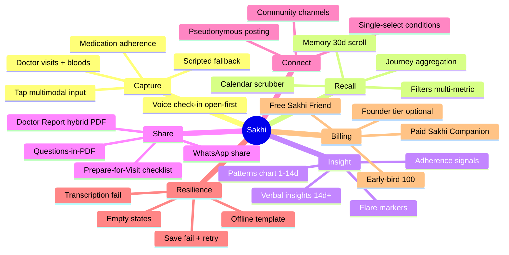

# Sakhi — Product Taxonomy

> **Living document.** The feature inventory is how we *build* the app. This taxonomy is how a user would *describe* what the app does. Useful for scoping conversations, marketing copy, deciding where a new idea belongs, and contributor onboarding.

**Maintenance rule:** when a feature ships, if it introduces a new capability not yet in the mindmap, add a leaf node and update the capability→feature table. When a capability is deprecated or deferred, strike it through and link to the backlog item.

---

## Capability mindmap

---

## Capability → feature delivery map

| Capability | Delivered by |
|---|---|
| Voice check-in (open-first) | F01 |
| Scripted fallback | F01 |
| Tap multimodal input | F01 (primary), F02 (reuse for edit) |
| Medication adherence | F01 (flag), F04 (regimen + log) |
| Doctor visits + blood work | F05 |
| Memory 30d scroll | F02 |
| Journey (unified) | F08 |
| Calendar scrubber | F02 |
| Filters (metric / flare / missed meds) | F02 |
| Patterns chart (visual 1–14d) | F03 |
| Verbal insights (14d+, ADR-014) | F03 |
| Flare markers / timeline | F02 (list), F05 (timeline), F08 (aggregation) |
| Doctor Report hybrid PDF | F06 |
| WhatsApp share (no hosted links) | F06 |
| Prepare-for-Visit checklist | F07 |
| Questions-in-PDF | F07 → F06 |
| Community channels | F09 |
| Edge-case resilience | F10 (templates), consumed by every feature |
| Free / paid tier | F02 (paywall banner), F06 (report quota), billing wiring post-MVP cycle |
