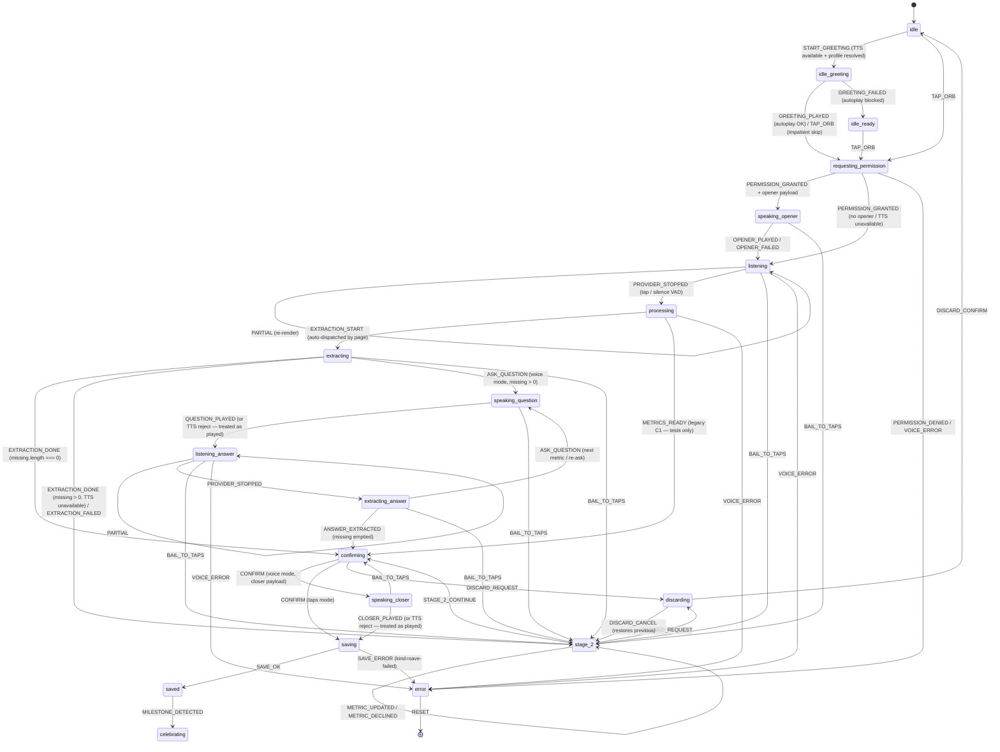

# Voice loop audit — current shipped behavior (2026-05-24)

Source of truth: `main` as of the audit date. Voice C1 (ADR-026 multi-turn) + fix-pass A–F have shipped. PR #21 (extract-429 voice-loop survival) was closed unmerged and is documented in `docs/post-mvp-backlog.md` §25 — the 429 path on `/api/check-in/extract` still falls into a fully-scripted Stage 2 silently.

## State machine

**Happy path (voice + Day-N, TTS-available browser):** mount → `idle` → `START_GREETING` plays opener via Web-Speech TTS → `idle-greeting` → `GREETING_PLAYED` → `requesting-permission` (hook fires `provider.start()` automatically) → `PERMISSION_GRANTED` (no opener payload — already played) → `listening`. User speaks; silence-VAD or `StopButton` tap → `PROVIDER_STOPPED` → `processing` → page auto-dispatches `EXTRACTION_START` → `extracting`. If extraction returns at least one missing metric and `ttsAvailable`, page dispatches `ASK_QUESTION` with the freeform-extract result as `seed` → `speaking-question` → TTS plays → `QUESTION_PLAYED` → re-arm STT → `listening-answer` → … loop until `missing` empty → `confirming` (stage `'hybrid'`). User taps Save → `CONFIRM` with closer payload → `speaking-closer` → `CLOSER_PLAYED` → `saving` → `SAVE_OK` → `saved` → `MILESTONE_DETECTED` or `router.push('/check-in/saved')`.

**Happy path (taps-only, no TTS — jsdom, web-speech missing):** opener-text renders via `<SpokenOpener autoSpeak={true}>` but `available` flips false → no TTS playback. `coldGreetingDispatchedRef` is gated on `ttsAvailable` so `START_GREETING` never fires. Tap orb → `requesting-permission` → `PERMISSION_GRANTED` (no payload — `getOpener` returns undefined when `!ttsAvailable`) → `listening` → … extract → if missing>0, dispatched as `EXTRACTION_DONE` (no `ASK_QUESTION`) → `stage-2`. User completes Stage 2 → `STAGE_2_CONTINUE` → `confirming` → payload-less `CONFIRM` → `saving`.

**Failure path A — permission denied:** `provider.start()` throws `{kind:'permission-denied'}` → `PERMISSION_DENIED` → `error` with that kind. Only `RESET` (via `ErrorSlot` "Try again") escapes.

**Failure path B — extract 429 / network / parse fail:** `/api/check-in/extract` returns 429 (`extract.daily_cap_reached`) or 502 (`extract.failed`). `extractMetrics` throws. The catch in `state, dispatch, …` effect dispatches `EXTRACTION_FAILED` → reducer routes to `stage-2` with all 5 metrics marked missing. **No spoken explanation is given** — the user simply lands on the scripted Stage 2 grid. (Documented gap, post-mvp-backlog §25.)

**Failure path C — STT mid-listen:** `provider.onError` fires `{kind:'no-speech'|'network'|'aborted'|…}` → `VOICE_ERROR` → `error`. Same single recovery (RESET).

**Failure path D — TTS playback rejects mid-loop:** `speak()` rejects for `speaking-opener` → reducer treats as `OPENER_FAILED` and degrades to `listening` (text still on screen). For `speaking-question` and `speaking-closer`, the page collapses the reject into the success dispatch (`QUESTION_PLAYED`/`CLOSER_PLAYED`) so the loop never traps on TTS failure.

## TTS inventory

| State / surface | String | Source | Trigger |
|---|---|---|---|
| `idle-greeting` (cold mount) | Opener line from `OPENER_VARIANTS` or `streakMilestoneOpener(N, name)` — see catalog (11 variants, e.g. `"Hey {name} — glad you're here. How are you feeling today?"`, `"Back again, {name} — anything else?"`, `"Morning, {name}. Dr. Mehta tomorrow — how are you feeling going in?"`) | Rules engine `selectOpener(continuityState, profileName)` | Page mounts in `idle`, TTS available, profile resolved → `START_GREETING` dispatch + effect calls `tts.speak(text)` |
| `idle-ready` (manual replay) | Same opener string | Re-read of `openerSelection.text` | User taps speaker glyph in `SpokenOpener` (`onReplayClick`) |
| `idle-ready` (un-mute) | Same opener string | `onConfirmUnmute` re-speaks once | User long-presses speaker → Un-mute |
| `speaking-opener` (post-permission voice mode) | Same opener string | `getOpenerForGrant()` snapshots `openerSelection` → reducer carries `state.text` | Hook dispatches `PERMISSION_GRANTED` with opener payload after `provider.start()` resolves on cold tap |
| `speaking-question` | One of 11 follow-up strings from `FOLLOW_UP_VARIANTS` — attempt-1 default per metric (`"How's the pain today on a 1 to 10?"`, `"And how are you feeling — heavy, flat, okay, bright, or great?"`, `"Did you take your medication today?"`, `"Any flare today — yes, no, or still ongoing?"`, `"And your energy today, 1 to 10?"`), the flare-ongoing tone variant (`"And the flare today — still ongoing, or different?"`), or the attempt-2 re-ask (`"Sorry — missed that. The pain today, 1 to 10?"` etc.) | `selectFollowUpQuestion(metric, attempt, continuityState)` | Page dispatches `ASK_QUESTION` either (a) after `EXTRACTION_DONE` resolves with missing>0, or (b) from `extracting-answer` answer-loop effect advancing to the next missing metric, or (c) from the decline/re-ask branch in `extracting-answer` |
| Decline acknowledgement (mid-loop, no state change) | One of 5 from `DECLINE_ACK_VARIANTS` — `"OK, skipping pain."`, `"OK, skipping mood."`, `"OK, skipping medication."`, `"OK, skipping flare."`, `"OK, skipping energy."` | `selectDeclineAcknowledgement(metric)` | `extracting-answer` effect detects decline phrase via `detectDecline(answerText)` and calls `tts.speak(ack.text)` before dispatching `ANSWER_EXTRACTED` with `declined:true` |
| `speaking-closer` | One of 11 closer strings from `CLOSER_VARIANTS` or `streakMilestoneCloser(N)` (e.g. `"Saved. That's the first one."`, `"Saved. Got the update."`, `"Logged. I'm here."`, `"Saved. Today's its own day."`, `"7 days. That's real."`) | `selectCloser(continuityState, profileName)` (pre-save) | User taps Save → page dispatches `CONFIRM` with `{closer:{text}}` when `ttsAvailable` |

No TTS for errors (`ErrorSlot` is text-only). No TTS for `saving` / `saved` / `celebrating`. No "Sorry, I didn't catch that" beyond the catalog re-ask line — fully scripted.

## User-input branches

Per listening-state, what voice/tap input is recognised vs ignored:

- **`listening`** (freeform first turn). STT collects all speech; partials surface as `state.partial` and render under the orb. Recognised intents: any speech (sent to extractor as transcript). Stop affordances: (a) `StopButton` tap → `TAP_ORB` → hook calls `provider.stop()`, (b) orb tap → same path, (c) recorder silence-VAD (Sarvam adapter — ~1.5 s trailing silence) → `onSilence` callback → `provider.stop()`. Not recognised at the transcript layer: "go back", "discard", "I don't know" — those become part of the transcript and the LLM may or may not extract anything. No interrupt-Saha-while-speaking semantics exist here because Saha isn't speaking. `BAIL_TO_TAPS` button is NOT mounted in `listening` (excluded by `isVoiceDialogState`).
- **`listening-answer`** (per-metric voice turn). Same STT model. Recognised at the page layer: (a) any speech containing a value the extractor maps to the current metric → folds into `metrics`; (b) decline phrases matched by `detectDecline(answerText)` → metric written as `null`, decline-ack TTS plays. Re-ask: if extract returns neither value nor decline, `reaskCountRef` bumps; first miss → attempt-2 question; second miss → silently treat as declined (`ANSWER_EXTRACTED` with `declined:true`) so the loop advances. Stop affordances same as `listening`. `BAIL_TO_TAPS` mounted (carries running payload into Stage 2). No way to say "go back to the previous metric" — loop is forward-only.
- **`idle-greeting`** (Saha speaking opener, mic not armed). User tap-orb interrupts: `TAP_ORB` → `requesting-permission`; page-level `tts.cancel()` runs as the `speaking-opener` effect's cleanup fires (effect tied to `state.kind`). No mid-speech "stop talking" verbal interrupt — input is tap-only.
- **`speaking-opener` / `speaking-question` / `speaking-closer`** (Saha speaking, mic not armed). No STT in flight, so no speech input. `BAIL_TO_TAPS` button is the only recognised input. Orb is in `processing` visual; tapping it dispatches `TAP_ORB` which the reducer ignores for these states.
- **Stage 2 (`stage-2`)**. Pure tap UI — tap inputs per metric (`onMetricUpdate`, `onMetricDeclined`), Continue, Discard. No voice input is recognised; voice loop is fully bailed.

## Error paths

Catch-by-catch, with user-visible outcome:

- **`provider.start()` rejects** (cold tap interceptor, `wrappedDispatch` for `TAP_ORB` from `idle`; auto-progress effect for `idle-greeting`/`idle-ready`): if `ve.kind === 'permission-denied'` → `PERMISSION_DENIED` → `error{kind:'permission-denied'}` → `ErrorSlot` showing `kind` (mono `"permission-denied"`), title `"Something got in the way."`, "Try again" button (RESET). Other voice-error kinds → `VOICE_ERROR` → same surface with a different `kind` string.
- **`provider.stop()` rejects** (tap-stop branch, silence-VAD callback): `voiceLog('error', {event:'tap_stop_threw'})`, then `VOICE_ERROR` → `error` surface. The Fix F.3 guard (`isStarted()` short-circuit) and Fix F.1 `stopInitiatedRef` dedupe try to prevent this in the re-arm window.
- **STT provider `onError`** (e.g. Sarvam route returns SSE `error` frame `voice.no_speech`, `voice.network`, `voice.session_too_large`, `voice.session_too_long`, `voice.provider_unconfigured`, `voice.bad_content_type`, `voice.tts_failed`, plus `voice.unprocessable`): adapter normalises to `VoiceError`, dispatches `VOICE_ERROR` → `error` surface with the kind shown in mono text below "Something got in the way." Only `rate-limited` exists as a typed VoiceErrorKind; the route does not actually emit it today.
- **Extract route error in freeform turn** (`POST /api/check-in/extract` returns 400/429/500/502 → `extractMetrics` throws `ExtractDailyCapError` for 429 or `ExtractFailedError` otherwise): page effect catches, dispatches `EXTRACTION_FAILED` → reducer drops to fully-scripted `stage-2` with all 5 missing. **User sees no message** — Stage 2 just appears. `ExtractDailyCapError` is currently a no-op marker comment ("future telemetry hook").
- **Extract route error in answer turn** (`extracting-answer` effect): caught silently, treated as no captured value → falls into re-ask path or, on second miss, silently auto-declined. User experience: Saha may re-ask once; if extract is still failing, the metric is skipped without explanation.
- **TTS reject — opener (cold mount)**: `idle-greeting` effect dispatches `GREETING_FAILED` → reducer routes to `idle-ready` with `greetingBlocked:true`. UI: speaker icon pulses (Fix C ring), subtitle changes to `"Tap the speaker to hear how Saha greets you, then tap the orb to begin."`
- **TTS reject — speaking-opener** (post-permission, multi-turn entry): `OPENER_FAILED` → reducer drops to `listening`. User sees no explicit error — the opener text is still on screen via the `<h1>` header.
- **TTS reject — speaking-question / speaking-closer**: page collapses reject into the success dispatch (`QUESTION_PLAYED`/`CLOSER_PLAYED`). Saha is silently mute; loop continues. Captioned question text is rendered as `<h2>` so the user can still read what's being asked.
- **Save mutation rejects** (`onSave` throws — server's `checkin.duplicate`, network, validator reject): `SAVE_ERROR{message}` → `error{kind:'save-failed', message}`. Page intercepts this branch specifically — re-renders `<ConfirmSummary>` with `saveError={message}` and exposes "Try again" + "Keep this for later" (enqueues to `lib/checkin/save-later`).
- **`/api/transcribe` short-circuits**: 415 (`voice.bad_content_type`), 503 (`voice.provider_unconfigured`), then SSE-frame errors `voice.session_too_large`, `voice.session_too_long`, `voice.network`, `voice.unprocessable` — all surface as `VOICE_ERROR` → generic `ErrorSlot`. Per-kind copy is not differentiated; the `kind` slug is shown in monospace.
- **`/api/speak` short-circuits**: 400 (`voice.bad_request`), 413 (`voice.text_too_long`), 503 (`voice.provider_unconfigured`), 502 (`voice.tts_failed`) — these all become a rejected `tts.speak()` promise. Per the TTS-reject paths above, they degrade silently (opener) or collapse into the success-dispatch (question/closer). User never sees a TTS-failure error surface.
- **Continuity / today-row query loading**: `onSave` throws synchronously (`"Today-row query still loading"` or `"Page not yet mounted"`) → `SAVE_ERROR` → save-failed surface. The page also gates `MILESTONE_DETECTED` on `continuityResolved` to avoid a false Day-1 milestone during the loading window.

## Provider lifecycle

Provider = STT adapter (`getVoiceProvider()` → `WebSpeechAdapter`/`OpenAIRealtimeAdapter`/`SarvamAdapter`). TTS provider is independent and stateless aside from `cancel()`.

**Armed (`provider.start()`) at:**

1. Cold tap from `idle`: `wrappedDispatch` intercepts `TAP_ORB`, dispatches `TAP_ORB` to the reducer (→ `requesting-permission`), and fires `provider.start()` in parallel. On resolve, dispatches `PERMISSION_GRANTED` with or without opener payload depending on `getOpenerForGrant()`.
2. Auto-progress effect: on `requesting-permission` entry from prior `idle-greeting` or `idle-ready` (i.e. greeting played, or user tapped after autoplay-blocked path), the effect fires `provider.start()` and dispatches `PERMISSION_GRANTED` (no opener payload — already played/read).
3. Re-arm for answer turn: `useLayoutEffect` on `listening-answer` entry fires `provider.start()` synchronously before paint (Fix F.3). Permission already granted in this session; the resolution does nothing because reducer is past `requesting-permission` and a stray `PERMISSION_GRANTED` is ignored.

**Disarmed (`provider.stop()`) at:**

1. `TAP_ORB` in `listening` / `listening-answer`: `wrappedDispatch` calls `provider.stop()`, awaits the transcript, dispatches `PROVIDER_STOPPED`. Guarded by `stopInitiatedRef` (Fix F.1) and `isStarted()` check (Fix F.3).
2. Silence VAD callback (Sarvam only — `onSilence`): same path, same guards. Fires after ~1.5 s of trailing silence detected by the recorder.
3. `BAIL_TO_TAPS` from `listening` or `listening-answer`: reducer routes to `stage-2`. Provider is NOT explicitly stopped by the reducer or hook on bail — the next state change (away from `listening`/`listening-answer`) clears `stopInitiatedRef`, but `provider.stop()` is not called. Open question: does the adapter's media stream stay live until GC? Sarvam adapter's `stop()` sets `started = false`; without a `stop()` call on bail the mic indicator may remain on. (Worth confirming on a live smoke.)

**Mic re-arms automatically:**

- Only on `listening-answer` entry (the answer-loop re-arm). All other entries into a listening-class state are gated on a deliberate user tap (`TAP_ORB` from `idle`/`idle-ready`).

**Mic does NOT re-arm automatically:**

- After `error`: only RESET → `idle`, then the user must tap-orb again.
- After `GREETING_FAILED` (autoplay block): user must tap the orb explicitly — the speaker-pulse cue tells them so.
- After `EXTRACTION_FAILED` falling into `stage-2`: voice loop is over, Stage 2 is tap-only.
- After `BAIL_TO_TAPS`: same as above.
- The PR #21 cliff edge documented in `post-mvp-backlog.md` §25: in voice mode, when extract-429 fires after the user has already heard a question (i.e. mid `extracting-answer`), the catch silently treats it as "no extracted value" → re-ask path → next ASK_QUESTION cycle. The reducer transitions fine, but provider arming for the next `listening-answer` is the failure mode the closed PR was trying to address. The architectural seam (reducer transitions + the salvaged `lib/checkin/extract-failure-fallback.ts`) is in place; the page-level orchestration that arms the provider on this entry path is not. Result on the live preview: Saha spoke the follow-up once, the UI froze, mic never re-armed.

## File:line citations

- State + Event unions, reducer, hook: `/Volumes/Coding Projects + Docker/autoimmune-health-companion/lib/checkin/state-machine.ts:43-167` (State), `:168-282` (Event), `:293-714` (reducer), `:803-1090` (hook + `wrappedDispatch`), `:1098-1102` (`normaliseVoiceError`), `:1106-1149` (bail-out helpers).
- Page orchestration: `/Volumes/Coding Projects + Docker/autoimmune-health-companion/app/check-in/page.tsx:282-287` (deferred user/profile/today resolution), `:520-562` (cold-greeting dispatch), `:622-688` (medication extract), `:729-753` (event extract), `:820-919` (freeform extract + voice-mode `ASK_QUESTION` seeding), `:925-941` (`speaking-opener` TTS effect), `:948-964` (`idle-greeting` TTS effect), `:967-986` (`speaking-question` TTS effect — TTS reject treated as `QUESTION_PLAYED`), `:992-1010` (`speaking-closer` TTS effect — TTS reject treated as `CLOSER_PLAYED`), `:1019-1093` (`extracting-answer` extract + decline-ack + re-ask), `:1098-1119` (answer-loop driver), `:1130-1151` (milestone routing), `:1391-1475` (render-tree), `:1454-1462` (StopButton mount), `:1464-1473` (SwitchToTapsButton mount), `:1484-1491` (`isVoiceDialogState`), `:1516-1549` (`transientCopyFor`).
- Opener / closer / follow-up engines + catalogs:
  - `/Volumes/Coding Projects + Docker/autoimmune-health-companion/lib/saha/opener-engine.ts:56-100` (priority order)
  - `/Volumes/Coding Projects + Docker/autoimmune-health-companion/lib/saha/variants.ts:55-123` (opener strings), `:130-147` (closer strings), `:156-168` (streak-milestone builders).
  - `/Volumes/Coding Projects + Docker/autoimmune-health-companion/lib/saha/follow-up-engine.ts:41-75` (selection + decline-ack)
  - `/Volumes/Coding Projects + Docker/autoimmune-health-companion/lib/saha/follow-up-variants.ts:42-82` (follow-up + decline-ack strings)
- SpokenOpener component (cold-mount text + replay/mute): `/Volumes/Coding Projects + Docker/autoimmune-health-companion/components/check-in/SpokenOpener.tsx:94-279`.
- Stop / bail buttons: `/Volumes/Coding Projects + Docker/autoimmune-health-companion/components/check-in/StopButton.tsx:43-83`, `/Volumes/Coding Projects + Docker/autoimmune-health-companion/components/check-in/SwitchToTapsButton.tsx:46-89`.
- Error surface: `/Volumes/Coding Projects + Docker/autoimmune-health-companion/components/check-in/ErrorSlot.tsx:26-76` (single template, "Something got in the way." + kind slug + "Try again").
- Voice provider interface: `/Volumes/Coding Projects + Docker/autoimmune-health-companion/lib/voice/types.ts:34-90` (`VoiceErrorKind`, `VoiceProvider`, `onSilence`, `isStarted`), `:107-128` (`TtsProvider`).
- Provider factories: `/Volumes/Coding Projects + Docker/autoimmune-health-companion/lib/voice/provider.ts:61-117`.
- Sarvam adapter lifecycle: `/Volumes/Coding Projects + Docker/autoimmune-health-companion/lib/voice/sarvam-adapter.ts:185` (`started` flag), `:244-258` (`onSilence`, `isStarted`), `:260-273` (`async start`), `:434-437` (`async stop`), `:585` and `:812` (`started = false`).
- API routes:
  - `/Volumes/Coding Projects + Docker/autoimmune-health-companion/app/api/transcribe/route.ts:168-325` (caps, SSE shape, error codes).
  - `/Volumes/Coding Projects + Docker/autoimmune-health-companion/app/api/speak/route.ts:81-164` (400/413/503/502 paths).
  - `/Volumes/Coding Projects + Docker/autoimmune-health-companion/app/api/check-in/extract/route.ts:69-180` (400 / 429 cap / 500 / 502 paths).
- PR #21 closed-context: `/Volumes/Coding Projects + Docker/autoimmune-health-companion/docs/post-mvp-backlog.md:266-287` (§25).
