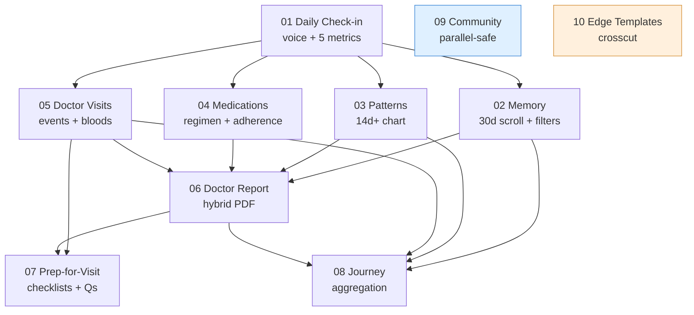
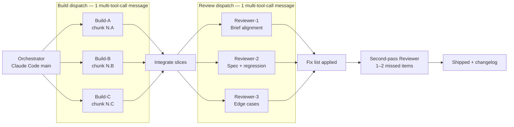
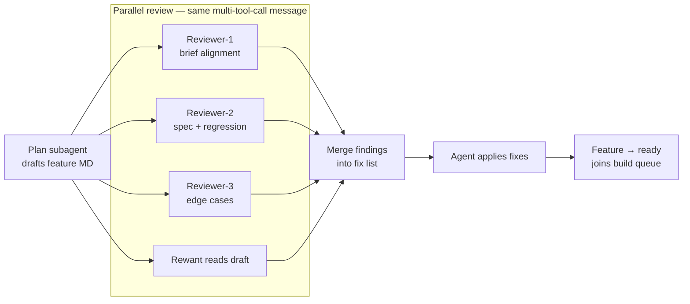
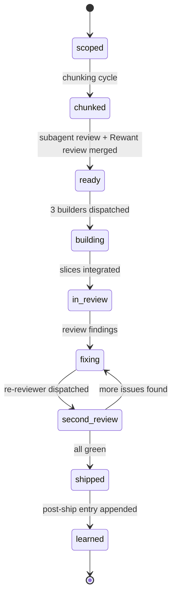
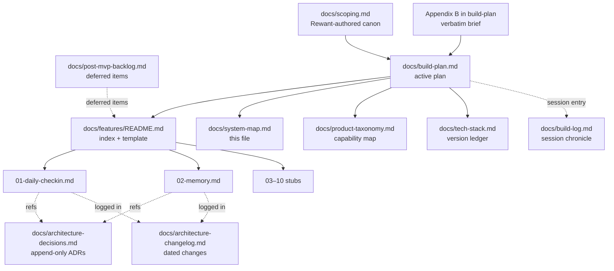

# Sakhi — System Map

> **Living document.** Updated after every shipped cycle. See also: [build-plan.md](build-plan.md) Section 9A.

**Maintenance rule:** after every cycle ships, update this file:
- Feature dependency diagram — mark shipped features with `:::shipped` style.
- Cycle status diagram — highlight which phase is current.
- Docs topology — add new feature MDs as they scaffold.

---

## Map 1 — Feature dependency graph

Shows what depends on what, and which features are parallel-safe. Arrows flow from prerequisites to dependents.

**Legend:** blue = parallel-safe (no data deps, can run any phase). Amber = crosscut (stubs scaffolded with every feature, finalized last). Green (when applied) = shipped.

---

## Map 2 — Sub-agent topology per cycle

Shows which agents fire in parallel, which fire solo, and the dispatch boundaries.

---

## Map 3 — Chunking cycle (F03–10) — dual track

Agent drafts + 3-reviewer-subagent check + Rewant review all run in parallel, then merge.

---

## Map 4 — Status lifecycle

The states every feature and chunk flows through.

---

## Map 5 — Docs topology

Where every doc lives and how they relate. Canonical docs on the left; generated / maintained docs on the right.

