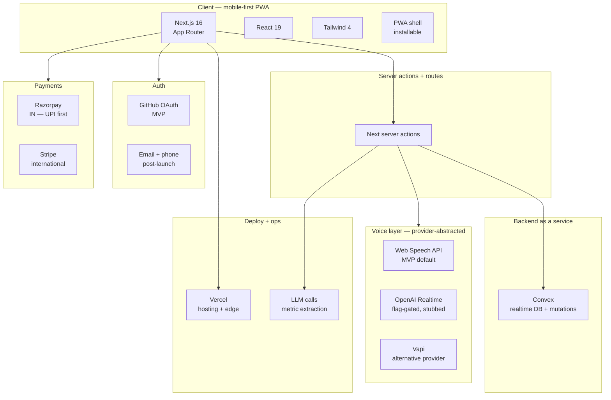

# Saha — Tech Stack

> **Living document.** Authoritative record of every dependency, version, and upgrade policy.

**Maintenance rule:** every dependency bump updates the version + "last upgraded" cell. Major bumps require an ADR entry and a changelog line. Renovate/Dependabot handles patch + minor auto-merges (post-MVP); for now, updates are manual.

---

## Stack layer diagram

---

## Dependency ledger

Current state as of 2026-04-25. Versions confirmed in `docs/build-log.md` 2026-04-23 Session 2.

| Package / service | Version | Purpose | Upgrade cadence | Last upgraded | Notes |
|---|---|---|---|---|---|
| Node | LTS (to confirm at setup) | Runtime | Track LTS | — | — |
| TypeScript | 5.x latest | Typing | Minor weekly | — | Strict mode on |
| Next.js | 16.2.4 | App framework | Major = ADR | 2026-04-23 | App Router, Turbopack |
| React | 19 | UI | Follows Next | 2026-04-23 | Server components enabled |
| Tailwind | 4 | Styling | Minor weekly | 2026-04-23 | — |
| Convex | latest | Backend DB + mutations | Minor monthly | 2026-04-23 | Dev: hardy-hamster-888. Prod: usable-zebra-515. Schema migrations logged in changelog |
| Web Speech API | browser-native | MVP voice fallback | n/a (browser) | — | Locale `en-IN` |
| OpenAI Realtime | TBD | Future primary voice | Major = ADR | — | Stubbed in F01 C1; flag `VOICE_PROVIDER` |
| Vapi | TBD | Alternative voice | As-needed | — | Abstraction in `lib/voice/provider.ts` |
| LLM for metric extraction | TBD (Claude Haiku / GPT-4o-mini) | Structured extraction | Major = ADR | — | Prompt-tested, 20+ fixtures |
| GitHub OAuth | TBD (NextAuth or Clerk) | MVP auth | Patch only pre-launch | — | Email + phone added post-launch |
| Razorpay SDK | TBD | IN payments | Minor quarterly | — | UPI primary |
| Stripe SDK | TBD | Intl payments | Minor quarterly | — | — |
| PDF generator | TBD (react-pdf / pdf-lib) | Doctor Report | Minor as-needed | — | Hybrid summary + appendix |
| Vercel platform | n/a | Deploy + edge | n/a | — | Project `autoimmune-health-companion` under `rewant24s-projects`. `vercel.json` checked in |

---

## Upgrade rules

| Change type | Process | Gate |
|---|---|---|
| Security patch | Apply immediately, changelog entry | None |
| Patch (`x.y.Z`) | Auto-merge (post-MVP: Renovate) | CI green |
| Minor (`x.Y.0`) | Weekly batch review, changelog entry | CI green + smoke test |
| Major (`X.0.0`) | Requires ADR + explicit review | ADR approved, migration tested |

---

## Breaking-change watch list

Pin attention whenever any of these upgrade:

- **Next.js** — App Router conventions shift across majors
- **React** — server-components API still evolving
- **Convex** — schema + auth model changes
- **Tailwind** — class name renames between majors
